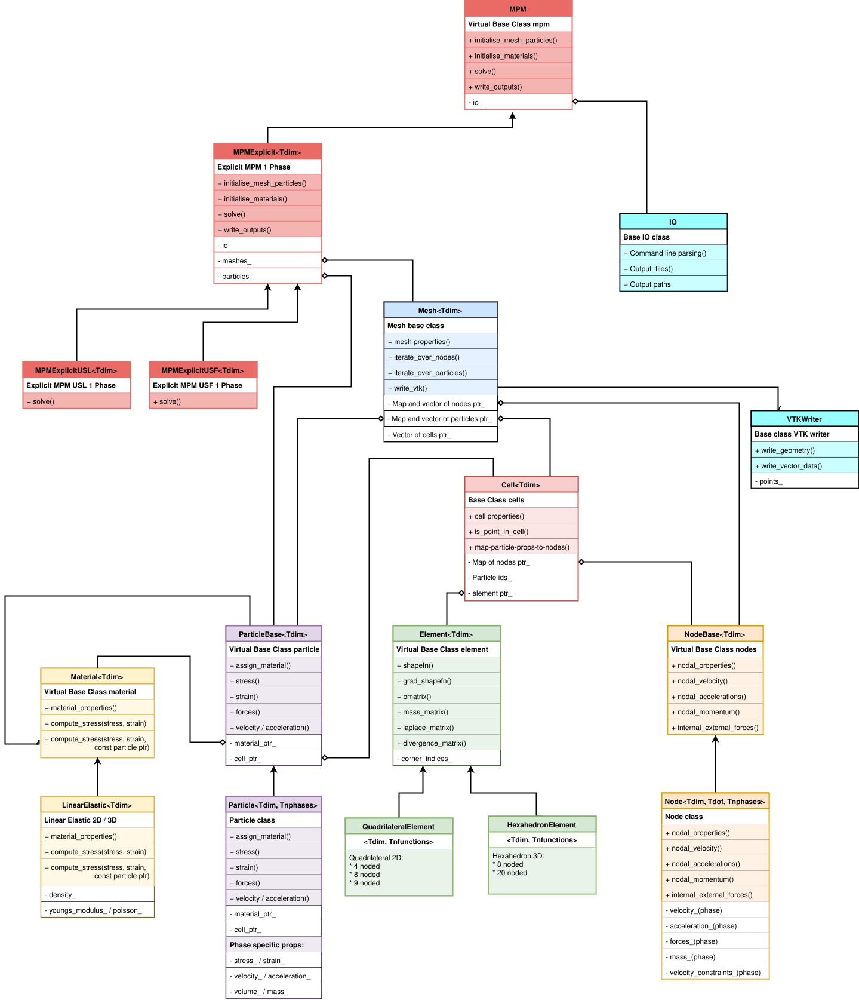

# Scalable and modular material point method for large-scale simulations
> Krishna Kumar, Kenichi Soga and Giovanna Biscontin

## Abstract
In this paper, we describe a new scalable and modular material point method (MPM) code developed for solving large-scale problems in continuum mechanics. The MPM is a hybrid Eulerian-Lagrangian approach, which uses both moving material points and computational nodes on a background mesh. The MPM has been successfully applied to solve large-deformation problems such as landslides, failure of slopes, concrete flows, etc. Solving these large-deformation problems result in the material points actively moving through the mesh. Developing an efficient parallelisation scheme for the MPM code requires dynamic load-balancing techniques for both the material points and the background mesh. This paper describes the data structures and algorithms employed to improve the performance and portability of the MPM code. An object-oriented programming paradigm is adopted to modularise the MPM code. The Unified Modelling Language (UML) diagram of the MPM code structure is shown in Figure 1. Modern CPUs are designed for Single Instruction Multiple Data (SIMD) operations and vectorizations. A parallel vector container is used to store and operate on the material points and the nodes in the background mesh. The material point properties such as acceleration, velocities, and positions can be updated independent of other material points in the mesh without resulting in a race condition, hence no special locking mechanism is necessary. On the other hand, nodes share information with all the material points in the cells connected to the node (and also the neighbouring cells in the case of GIMP). Updating these nodal information (for e.g., velocity / momentum) requires aggregating properties from all the material points in the associated cell and its neighbours. To prevent race conditions on nodal updates, an associated mutex lock is enabled at each node during a property update. Thus, all functions on material points and nodes in the code are parallel operations. At a function level, updating information such as location, stresses, and strains requires iterating over each component using a `for` loop. A for-loop with a known size can be unrolled and optimised during compilation. However, the flexibility of modelling different phases and dimensions using a single material point (for e.g., 2D v. 3D arrays and multi-phase represented on a single material point), requires a dynamically sized array, which cannot be unrolled at compile-time. To improve the compile-time optimisation, the material point class is templatised based on dimension and the number of phases, and the node class is templatised with an additional degrees of freedom argument. Templates in C++ enables optimisation as the array sizes are known at compilation. A generic factory pattern that can handle constructors with arbitrary number of arguments is developed to instantiate material points, nodes and cells of required types. Although parallel vector containers are useful to vectorise, fetching a particular node or a material point requires iterating through all the components in a container and has a worst performance order of O(n), where `n` is the size of the container. To improve the performance of identifying a material point pointer or a nodal pointer, a map data structure is used. A map has an average order of lookup O(1). A map is created with the unique global id  of the node / material point as the key. The map container is used to identify and apply functions (for e.g., boundary conditions) at a given node or a material point. In the MPM, the velocity and acceleration boundary conditions are applied at the nodes. Non-prismatic boundaries like those that can be found in landslides pose problems when applying nodal boundary conditions on irregular surfaces. The MPM code uses isoparametric elements to model complex geometries and boundary conditions. Unlike the Finite Element Method, where the location of Gauss points in an element is known in the natural coordinates, the use of isoparametric elements in the MPM requires transforming the location of material points from the real coordinates to the natural coordinates. The inverse transform of the linear mapping from natural to real coordinates does not have an analytical solution in 3D. The MPM code uses Newton Raphson iterations to transform the coordinates. Affine transformation is used to make an improved the initial guess, which oftentimes does not require the Newton Raphson iterations. This combined approach in transforming real to natural coordinates improves the solution speed, and the performance is similar to using cartesian grids. Inputs to the MPM code is configured through a JSON data structure. The MPM code allows for check point restart using HDF5 data of material points stored at each time-step. The results from the MPM simulations are visualized using a compressed binary VTK files. An interactive Jupyter Notebook can also be used to perform post-processing and analysis on the simulation results stored in HDF5 format. The MPM code is distributed under MIT license and is available at [https://github.com/cb-geo/mpm](https://github.com/cb-geo/mpm).

## Keywords
> Material Point Method, Shared-memory parallel, Threaded Building Blocks, Templates, C++14

> Figure 1: UML diagram of the CB-Geo mpm code structure

